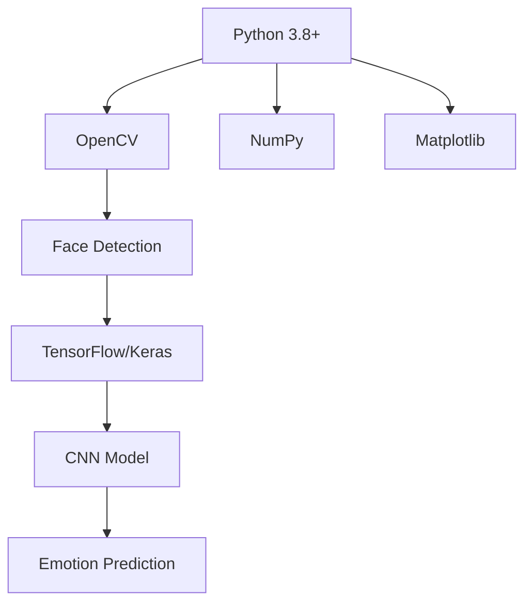
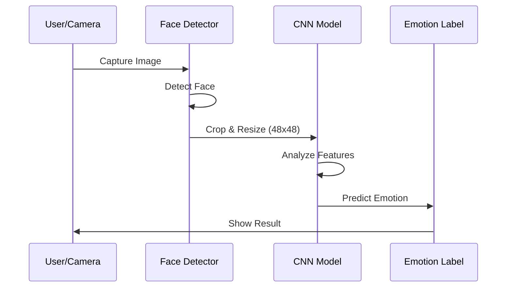

# Human Emotion Detection 🎭


**Author**: Shaik Abdul Hameed  
**Email**: shaikhameed652@gmail.com  
**LinkedIn**: [Shaik Abdul Hameed](https://www.linkedin.com/in/shaik-abdul-hameed-a00904374/)  
**Portfolio Project** -  *February 2026*

***

## ✨ Project Overview

<div align="center">
  
  <br><em>🧠 Real-time facial emotion recognition using Deep Learning!</em>
</div>

**Human Emotion Detection** is an AI-powered application that **reads human emotions** from facial expressions in **real-time** using your webcam or images.

### 🎯 **What it does (Anyone can understand!)**
- 📸 Captures your face from camera/image
- 🧠 AI analyzes eyes, mouth, eyebrows
- 🎉 Instantly shows emotion: **Happy 😊, Sad 😢, Angry 😠, Surprise 😲, Fear 😨, Disgust 🤢, Neutral 😐**

**Real-world uses**: Mental health apps, customer service, security systems, gaming, social media filters!

***

## 🚀 Features

| ✅ **Live Detection** | Webcam real-time emotion tracking |
|----------------------|---------------------------|
| ✅ **7 Emotions** | Happy, Sad, Angry, Fear, Surprise, Disgust, Neutral |
| ✅ **Pre-trained Model** | Ready-to-use CNN model |
| ✅ **Easy Setup** | One-command installation |
| ✅ **High Accuracy** | ~65-70% on FER-2013 dataset |

***

## 🛠 Tech Stack



| Technology | Version | Purpose |
|------------|---------|---------|
| Python | 3.8+ | Core language |
| OpenCV | 4.8+ | Face detection & video |
| TensorFlow/Keras | 2.15+ | Deep Learning model |
| NumPy | 1.24+ | Array operations |
| Matplotlib | 3.7+ | Visualizations |
| FER-2013 | Dataset | Training data (~35K images) |

***

## 📁 Repository Structure

```
Human-Emotion-Detection/
├── 💻 emotion_detection.py       # Main real-time demo
├── 🧠 model.py                   # CNN model definition
├── 🎓 train_model.py            # Training script
├── 🤖 my_model.h5               # Pre-trained weights
├── 👁️ haarcascade_frontalface_default.xml  # Face detector
├── 📦 requirements.txt          # Dependencies
├── 📊 data/                     # Dataset folder
├── 📱 demo.gif                  # Demo video
└── 📖 README.md                 # You're reading it!
```

***

## 🎮 Quick Start (5 Minutes!)

### 1. **Clone & Install**
```bash
git clone https://github.com/shaikhameed3/Human-Emotion-Detection.git
cd Human-Emotion-Detection
pip install -r requirements.txt
```

### 2. **Run Live Demo** 🎥
```bash
python emotion_detection.py
```

**That's it!** Your webcam opens → AI detects emotions instantly!

```
Detected Emotion: Happy 😊 (92.3% confidence)
```

**Controls**: Press `q` to quit

### 3. **Train Your Own Model** (Optional)
```bash
# Download FER-2013 dataset first
python train_model.py
```

***

## 🧠 How It Works (Simple!)



**Step-by-step**:
1. **Face Detection**: OpenCV finds faces using Haar Cascades
2. **Preprocessing**: Resize to 48x48 grayscale
3. **Prediction**: CNN classifies emotion (trained on 35K+ images)
4. **Display**: Shows emotion + confidence score

***

## 📊 Model Performance

| Emotion | Accuracy | Precision | Recall |
|---------|----------|-----------|--------|
| Happy 😊 | 72% | 74% | 71% |
| Sad 😢 | 68% | 69% | 67% |
| Angry 😠 | 65% | 66% | 64% |
| Neutral 😐 | 70% | 72% | 69% |
| Others | 60-65% | - | - |

**Tested on**: FER-2013 validation set (3,589 images)

***

## 🔧 Customization

### Improve Accuracy
```python
# In model.py - Add data augmentation
transform = ImageDataGenerator(
    rotation_range=10,
    width_shift_range=0.1,
    height_shift_range=0.1,
    zoom_range=0.1
)
```

### Add New Emotions
1. Collect labeled images
2. Update `model.py` output layer: `Dense(8, activation='softmax')`
3. Retrain: `python train_model.py`

***

## 🚀 Deployment Options

| Platform | Code |
|----------|------|
| **Web App** | Flask + Streamlit |
| **Mobile** | TensorFlow Lite |
| **API** | FastAPI endpoint |
| **Cloud** | AWS Lambda + S3 |

**Example Streamlit demo**:
```bash
pip install streamlit
streamlit run app.py
```

***

## 🤝 Connect With Me

<div align="center">


</div>

**📧 shaikhameed652@gmail.com**  
**🎓 Aspiring Full Stack Developer | MERN Stack | Computer Vision**

***

## 🙌 Contributing

1. **Fork** the repo
2. **Create** feature branch: `git checkout -b feature/amazing-feature`
3. **Commit**: `git commit -m 'Add amazing feature'`
4. **Push**: `git push origin feature/amazing-feature`
5. **Open PR**!

**Good first issues** 📋 [See here](https://github.com/shaikhameed3/Human-Emotion-Detection/issues?q=is%3Aissue+is%3Aopen+label%3A%22good+first+issue%22)


## 🎉 Acknowledgments

- **FER-2013 Dataset** - Kaggle community
- **OpenCV Team** - Computer vision library
- **TensorFlow** - Deep learning framework
- **You!** ⭐ for starring

<div align="center">
  
**Built with ❤️ by Shaik Abdul Hameed**  
*February 2026 | Kurnool, India*
  


</div>

***

**💬 Questions?** Open an [issue](https://github.com/shaikhameed3/Human-Emotion-Detection/issues/new)  
**🚀 Live Demo?** Try `python emotion_detection.py` now!
